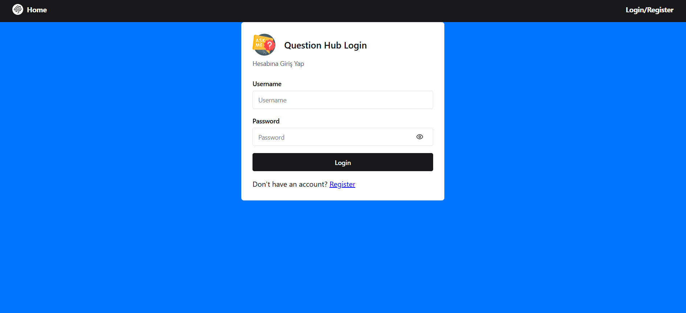
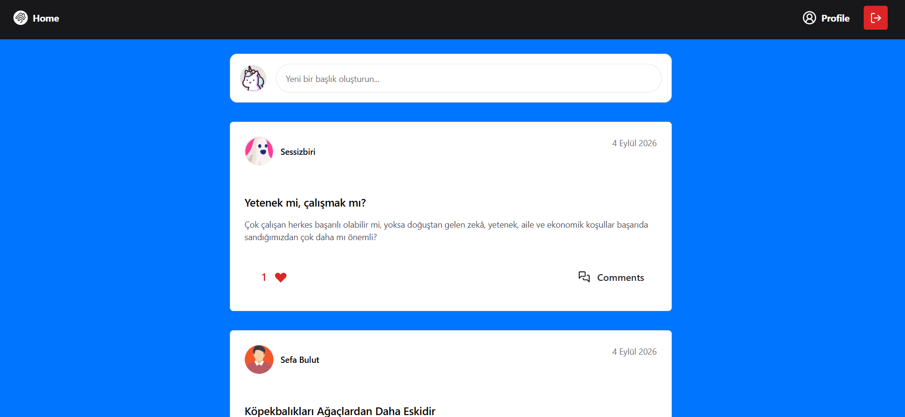
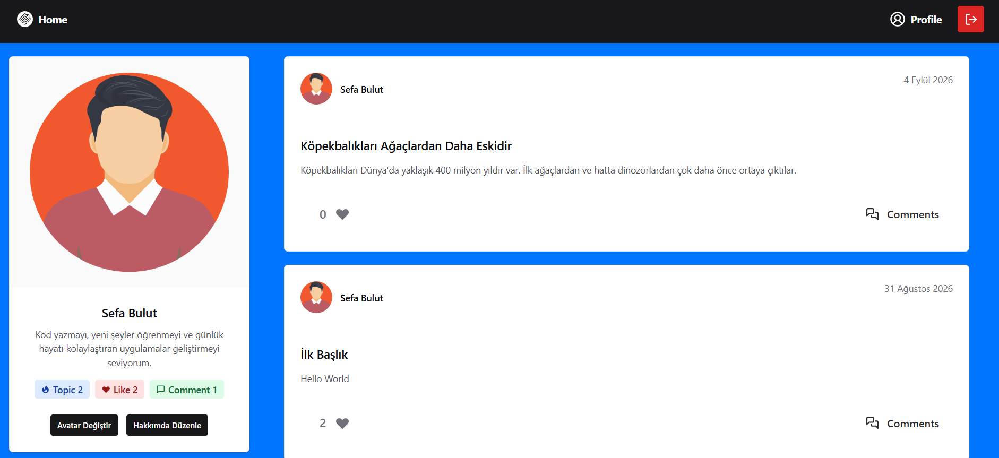
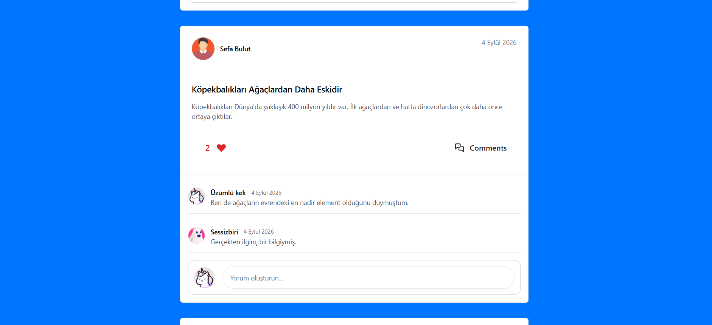
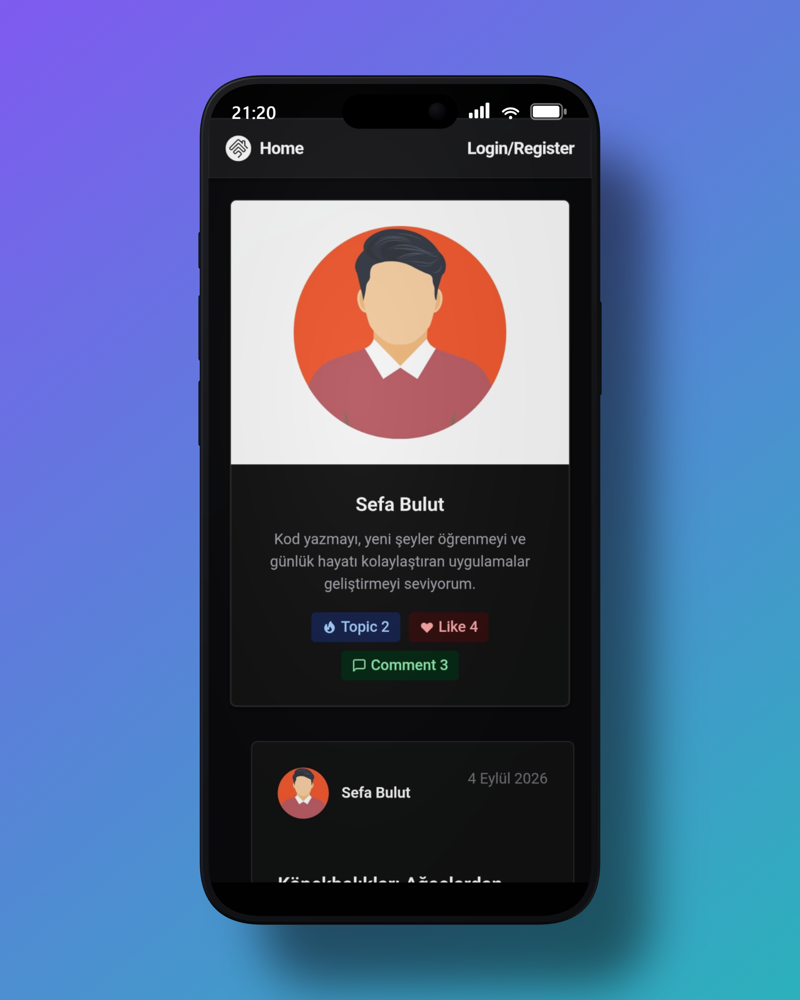
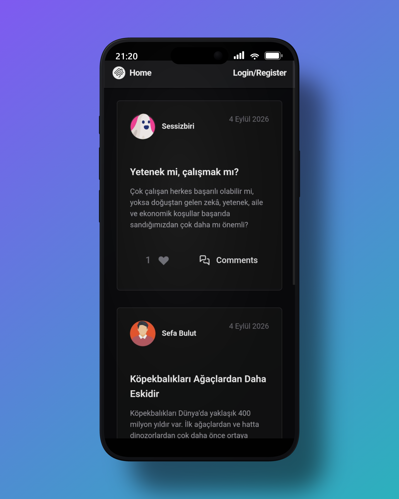
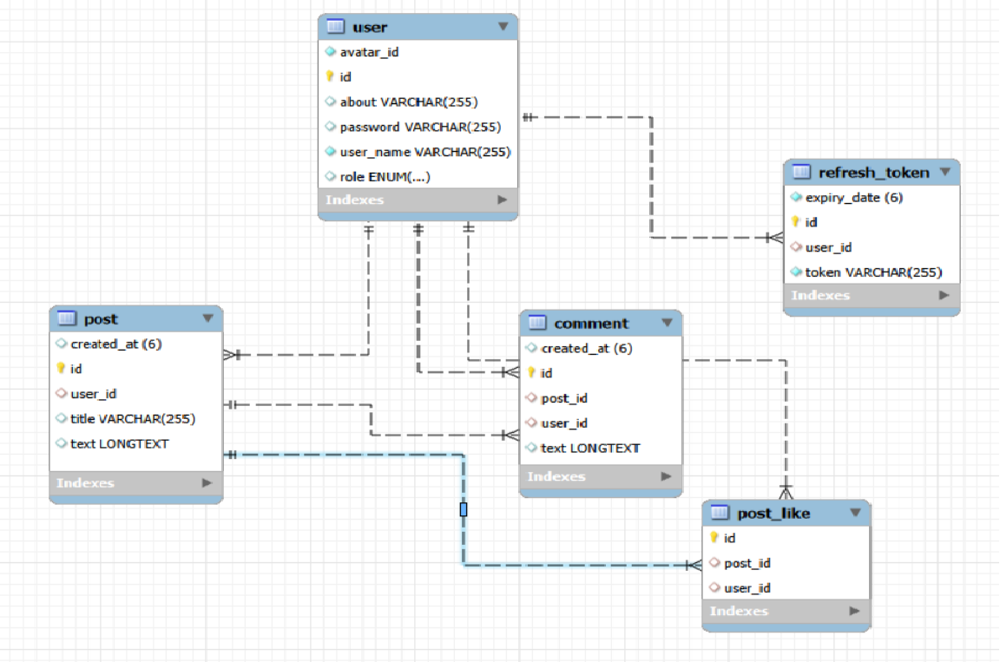

# Question Hub (Full-Stack Web Application)

Question Hub, kullanıcıların yorum, gönderi ve beğeni yapabildiği, sosyal medya yapısına sahip full-stack bir web uygulamasıdır. Uygulamanın backend kısmı Spring Boot, frontend kısmı React ve veritabanı kısmı MySQL kullanılarak geliştirilmiştir.

🌐 **Live Demo:** https://question-hub-sooty.vercel.app

> ⚠️ **Not:** Ücretsiz hosting kullanıldığından dolayı uygulamanın ilk açılışında 1–2 dakikalık bir cold start süresi olabilir. Lütfen ilk yüklemede bir süre bekleyiniz. Sonraki kullanımlarda uygulama normal bir şekilde çalışacaktır.

## 📸 Screenshots

### 🖥️ Web

<p align="center">
  
  
  
  
</p>

### 📱 Mobile

<p align="center">
  
  
</p>

---

## ✨ Features

* Kullanıcı kayıt ve giriş işlemleri
* JWT tabanlı authentication
* Access Token ve Refresh Token yönetimi
* Kullanıcı yetkilendirme
* BCrypt ile güvenli parola saklama
* Soru/gönderi oluşturma
* Gönderilere yorum yapma
* Gönderi beğenme ve beğeniyi kaldırma
* Gönderilerin beğeni sayılarını görüntüleme
* Kullanıcı profillerini görüntüleme
* Profil bilgilerini güncelleme
* Avatar seçimi ve güncelleme
* Kullanıcının kendi gönderilerini görüntülemesi
* Gönderileri tarihe göre sıralama
* Responsive kullanıcı arayüzü (Mobil & Web)
* Frontend ve backend arasında REST API iletişimi
* Global Exception Handling ile merkezi hata yönetimi

---

## ⚙️ Tech Stack

### Frontend

* React 19
* Vite
* Chakra UI
* Axios

### Backend

* Java 21
* Spring Boot
* Spring Data JPA
* Hibernate
* Spring Security & JWT

### Database

* MySQL

---

## 🏗️ Project Architecture

```text
QuestionHub
│
├── backend/
│   ├── src/
│   │   └── main/
│   │       ├── controllers/
│   │       ├── dto/
│   │       ├── entities/
│   │       ├── exceptions/
│   │       ├── repositories/
│   │       ├── security/
│   │       └── services/
│   │
│   ├── Dockerfile
│   ├── pom.xml
│   └── mvnw
│
├── frontend/
│   ├── src/
│   │   └── assests/
│   │       ├── avatarImages/
│   │       └── components/
│   │       ├── Comment/
│   │       ├── Post/
│   │       ├── Profile/
│   │       ├── Navbar/
│   │   └── contexts/
│   │       ├── AuthContext/
│   │       └── pages/
│   │           ├── Auth/
│   │           ├── Home/
│   │           ├── User/
│   │           ├── NotFoundPage/
│   │       └── services/
│   │           ├── api/
│
└── README.md
```

* Frontend tarafında Component tabanlı bir mimari benimsenerek; arayüz sorumlulukları modüler bir yapıyla birbirinden ayrıştırılmıştır. Kullanıcı kimlik doğrulama süreçleri React Context API ile global olarak yönetilirken, backend REST API ile olan veri akışları Axios API servis katmanı üzerinden yürütülmüştür.

* Backend tarafında ise Controller → Service → Repository katmanlarından oluşan bir yapı kullanılarak uygulama sorumlulukları birbirinden ayrıştırılmıştır.

---

## 🔐 Authentication & Security

QuestionHub'da kullanıcı kimlik doğrulama işlemleri **Spring Security ve JWT** kullanılarak gerçekleştirilmiştir.

* **Access Token**, API isteklerinin sınırlı bir süre boyunca yetkilendirilmesinde kullanıldı.
* **Refresh Token**, Access Token'ın süresi dolduğunda, kullanıcıdan tekrar giriş yapmadan access tokenlarını yenileyebilmesi için kullanıldı.
* **BCrypt**, Kullanıcı parolalarının veritabanında düz metin yerine hashlenerek saklanmasını için kullanıldı.

---

## 📡 API Endpoints

Backend, RESTful API yaklaşımı kullanılarak geliştirilmiştir.

### Authentication

| Method | Endpoint         |
| ------ | ---------------- |
| POST   | `/auth/register` |
| POST   | `/auth/login`    |
| POST   | `/auth/refresh`  |
| POST   | `/auth/logout`   |

### Users

| Method | Endpoint                |
| ------ | ----------------------- |
| GET    | `/users`                |
| GET    | `/users/{userId}`       |
| GET    | `/users/stats/{userId}` |
| POST   | `/users`                |
| PUT    | `/users/{userId}`       |
| DELETE | `/users/{userId}`       |

### Posts

| Method | Endpoint                 |
| ------ | ------------------------ |
| GET    | `/posts`                 |
| GET    | `/posts/{postId}`        |
| GET    | `/posts?userId={userId}` |
| POST   | `/posts`                 |
| PUT    | `/posts/{postId}`        |
| DELETE | `/posts/{postId}`        |

### Comments

| Method | Endpoint                                    |
| ------ | ------------------------------------------- |
| GET    | `/comments`                                 |
| GET    | `/comments?postId={postId}`                 |
| GET    | `/comments?userId={userId}`                 |
| GET    | `/comments?userId={userId}&postId={postId}` |
| GET    | `/comments/{commentId}`                     |
| POST   | `/comments`                                 |
| PUT    | `/comments/{commentId}`                     |
| DELETE | `/comments/{commentId}`                     |

### Likes

| Method | Endpoint                                 |
| ------ | ---------------------------------------- |
| GET    | `/likes`                                 |
| GET    | `/likes?postId={postId}`                 |
| GET    | `/likes?userId={userId}`                 |
| GET    | `/likes?userId={userId}&postId={postId}` |
| GET    | `/likes/{likeId}`                        |
| POST   | `/likes`                                 |
| DELETE | `/likes/{likeId}`                        |

## 🗄️ Database Structure

<p align="center">
  
</p>

---

## 🔑 Environment Variables

Backend'in çalışabilmesi için gerekli veritabanı ve JWT ayarlarını environment variable olarak sağlamanız gerekir.

Örnek:

```env
MY_DB_URL=your_database_url
MY_DB_USERNAME=your_database_username
MY_DB_PASSWORD=your_database_password

MY_JWT_SECRET_KEY=your_jwt_secret
```

---

## 📱 Responsive Design

* QuestionHub farklı ekran boyutlarında (Mobil & Web) kullanılabilecek şekilde tasarlanmıştır.
* Frontend tarafında **Chakra UI** kullanılarak responsive component ve layout yapıları oluşturulmuştur.

---

## 🚀 Deployment

| Component | Platform |
| --------- | -------- |
| Backend   | Render   |
| Frontend  | Vercel   |
| Database  | Aiven    |
